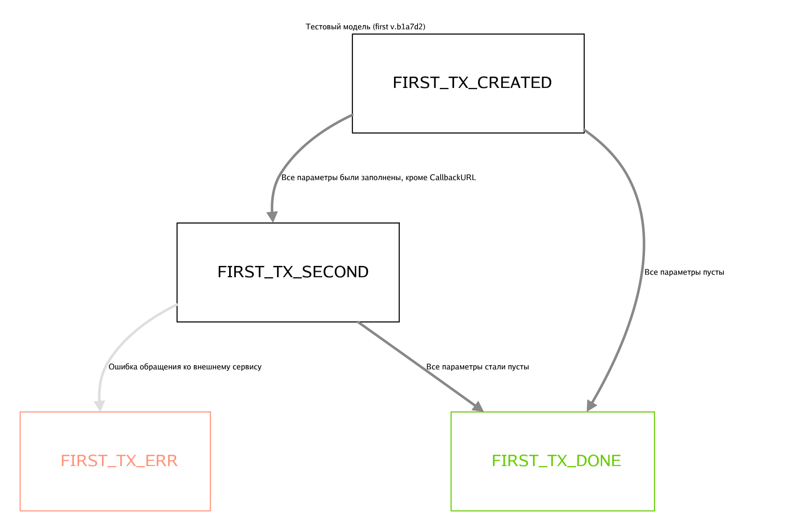

# go-fsm-framework

Фреймворк позволяет генерировать fsm-модели и запускать их в рамках fsm-движка. 
Он подходит для решения задач с множеством состояний и заранее известными наборами переходов между ними.

### todo

- генератор необходимо сильно доработать, научить его принимать параметры и флаги
- имплементировать cancel_ttl и прочие штуки для наблюдения
- имплементировать паттерн outbox для обеспечения атомарности операции публикации события о переходе в новое состояние
- сбор метрик

## Установка

```shell
go get "github/vkpay/fsm-framework.git"
go install "github/vkpay/fsm-framework.git/cmd/fsm-generator@latest
```

## Глоссарий

### fsm-модель

Модель в конечной-машине-состояний (конечный автомат) представляет собой ориентированный граф. 
Вершинами графа являются состояния, а ребрами являются переходы между этими состояниями.
Этот граф может содержать циклы, но в конечном счете из начального (`initial`) состояния должен быть путь 
до любого из конечных (`final`).



### fsm-движок

Движок в fsm-фреймворке – набор компонентов, обеспечивающий переходы между состояниями внутри fsm-модели. 
По сути это часть приложения, постоянно обрабатывающая события об изменении состояний в фоне.

Для безопасного и корректного функционирования движка необходимо соблюдение следующих условий:
1. использование идемпотентных, т.е. безопасных для исполнения с одними и теме же входными данными, обработчиков событий (`event handler`)
1. использование механизма распределённых блокировок (например, Redis), удовлетворяющего интерфейсу `fsm-engine/lock/lock.go`
1. использование брокера сообщений в режиме стратегии At-Least-Once, т.е. сообщение будет обработано как минимум единожды (например, RabbitMQ), удовлетворяющего интерфейсу `fsm-engine/queue/queue.go`
1. использование постоянного хранилища данных (например, PostgreSQL), удовлетворяющего интерфейсу `fsm-engine/model/repository.go`

## Использование

### Декларирование первой fsm-модели

Модель декларируется в проекте в виде `yaml` файла:

```yaml
title: "Тестовая модель" # заголовок модели

# todo: имплементировать многие из перечисленных здесь параметров
# параметры по умолчанию, их можно перезаписывать в отдельных состояниях
default_config:
  # максимальное количество повторений
  # todo: "-1" – обработать состояние единожды (при ошибке попадет в fallback failed state)
  max_retry_count: 3
  # минимальная задержка между обработками сообщений в очереди
  min_retry_delay: 15s
  # время спустя которое, транзакция считается застрявшей в текущем состоянии (кроме финальной)
  cancellation_ttl: 30m

# список состояний
states:
  - name: CREATED
    description: "Начальное состояние транзакции"
    initial: true
    disable_fallback_state: true
    transitions:
      - to: SECOND
        condition: "Все параметры были заполнены, кроме CallbackURL"
      - to: DONE
        condition: "Все параметры пусты"
  - name: SECOND
    description: ""
    disable_fallback_state: true
    transitions:
      - to: ERR
        condition: "Ошибка обращения ко внешнему сервису"
      - to: DONE
        condition: "Все параметры стали пусты"
  - name: ERR
    fail_final: true
  - name: DONE
    success_final: true
```

Файл принято размещать по пути `internal/fsm/models/<model_name>.yaml`. После этого необходимо запустить `fsm-generator` в директории проекта:

### Генерация файлов для fsm-движка

```shell
cd go/src/path/to/project
fsm-generator
```

В результате будут сгенерированы файлы модели `internal/app/fsm/<model_name>` с декларированными состояниями. 
Некоторые из этих файлов не подлежат редактирования и будут перезаписаны при повторном вызове генератора.

Прим.: Пример структуры проекта представлен в `/docs/example-project`

### Описание бизнес-логики

В файлах состояния вида `<state_name>.handler.fsm.go` следует описывать бизнес-логику перехода в следующее состояние. 
В рамках обработки события (`event`) перехода будет вызван описанный обработчик (`handler`), 
который должен сообщить движку следующее состояние (из той же модели) для перехода в зависимости от бизнес-логики.

Важной особенностью написания обработчиков событий для состояний является соблюдение принципа идемпотентности. 
Это необходимо для избежания проблем с повторным исполнением в рамках стратегии `At-Least-Once` брокера. 
Несмотря на это fsm-движок всячески препятствует повторному исполнению обработчиков путем введения распределённых блокировок 
и дополнительных проверок перед началом обработки события.

```go
package first_model

import (
   "context"

   "github/fsm-framework.git/fsm-engine/model"
)

func (s *SomeStateDeclaration) EventHandler(ctx context.Context, ev *model.Event) model.State {
   err := s.Service().Foo(ev.Tx.CallbackURL())
   if err != nil {
      return ErrState // error state in this model
   }

   return DoneState // another state in this model
}

```

### Инициализация fsm-движка

Для интегрирования фреймворка в проект следует инициализировать все используемые модели и сам движок:

```go
engine := fsmengine.New(fsmengine.Config{
    Repository:      repo,
    Locker:          locker,
    Broker:          broker,
    CallbackManager: nil_cbm.New(), // http_cbm also included in fsm-engine module
})
defer engine.Stop(ctx)

// init model
firstModel := first.Model

// optionally setup matching service struct for the model
//
// err = firstModel.SetService(svc)
// if err != nil {
//     return err
// }

err = engine.AddModel(ctx, firstModel)
if err != nil {
    return err
}
```

### Методы fsm-движка

После инициализации станет доступен потокобезопасный API fsm-движка, состоящий из следующих методов:

```go
type Engine interface {
   // AddModel инициализирует очередную fsm модель
   AddModel(ctx context.Context, newModel Model) error
   // Resolve поиск состояния по названию среди инициализированных моделей, nil - если не найдено
   Resolve(ctx context.Context, state string) (State, Model)
   // CreateTx задает переданной транзакции начальное состояние и отправляет событие на его обработку
   CreateTx(ctx context.Context, tx Tx, initState State) error
   // Transit создает событие на проведение транзакции из одного состояния в другое
   Transit(ctx context.Context, tx Tx, newState State) error
}
```